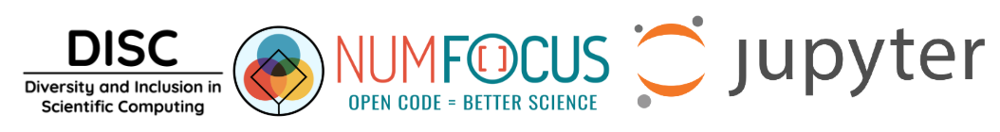

  

  

---

# Open Source Inclusion Sprint - Beginners Welcome!   

Contribute to your first open source project and play with [JupyterLab](https://blog.jupyter.org/jupyterlab-is-ready-for-users-5a6f039b8906) - no prior experience necessary!

  

Join us at the **Two Sigma** offices in lovely **SoHo NYC** for a day of fun and learning. Core contributors from the **JupyterLab** project will be on-site to get you setup and help trouble-shoot your code. 

If you've never contributed to open source this event is for you.

Breakfast and lunch provided.

**What to bring:**
- Laptop
- Charger
- Curiosity

----
## Schedule
**Date:** Friday, October 26th ([register](https://www.eventbrite.com/e/numfocus-open-data-science-hackathon-tickets-50877368579)) (**Discount Code**: DISC)

**Location:** 101 6th Ave, New York, NY 10013 ([map](https://goo.gl/maps/pcSymKQ17NP2))

**Gitter:** https://gitter.im/disc-sprint-nyc-2018/Lobby#

- 8:30 am - 9:00 am: Breakfast with GitHub account and technical setup (optional)
- 9:00 am - 9:30 am: Introduction to [Project Jupyter](http://jupyter.org/) and [JupyterLab](https://github.com/jupyterlab/jupyterlab)
- 9:30 am - 1:00 pm: Coding
- 1:00 pm - 2:00 pm: Lunch will be provided
- 2:00 pm - 6:00 pm: Coding

----
## Featured Hacks
Not confident in your coding chops? Want to learn more about how to use Jupyter? Have something else in mind? No problem! Let us know what you'd like to learn and we'll show you how Jupyter can make the experience easier.

* [Let’s Make an xkcd JupyterLab Extension](https://jupyterlab.readthedocs.io/en/stable/developer/xkcd_extension_tutorial.html#xkcd-extension-tutorial) (Beginner)
  
  Create your own JupyterLab Extension and publish it to GitHub and NPM.

  - **Prerequisites:** Some programming experience. No prior Python or JupyterLab experience necessary.

  - **Facilitators:** [Jessica Ford](https://github.com/jzf2101), [Steve Silvester](https://github.com/blink1073)

* [Practical machine learning with the Jupyter Notebook](https://github.com/sbrice/practical-ml) (Intermediate)

  Walk through developing a machine learning pipeline, from prototyping to production, with the Jupyter platform. Using the **[Recommendation engine](https://github.com/sbrice/practical-ml/tree/master/recommendation)** or **[Anomaly detection](https://github.com/sbrice/practical-ml/tree/master/anomaly)** notebook learn at your own pace and seek help from the facilitators as you need it. Prior programming experience required. 

  - **Prerequisites:** Python programming experience, basic familiarity with math (e.g. linear algebra), and data analysis.

  - **Facilitators:** [Samuel Brice](https://github.com/sbrice)

* [Get Started with TensorFlow](https://www.tensorflow.org/tutorials/) (Advanced)

  Learn and use ML by going through some beginner-friendly notebook examples. We'll go through training a neural network to classify images and text. This is a fast-paced overview of complete TensorFlow programs with the details explained as we go. Prior experience with Python and Jupyter required.

  - **Prerequisites:** Python programming experience, basic familiarity with math (e.g. linear algebra), and data analysis.

  - **Facilitators:** [Samuel Brice](https://github.com/sbrice)

Based on interest we'll create workshops focused on the above topics. If you have something else in mind feel free to email Sam Brice (brices@gmail.com).
  

----
## Code of Conduct
**NumFOCUS is dedicated to providing a harassment-free experience for everyone.** We do not tolerate harassment of participants in any form. All communication should be appropriate for a professional audience including people of many different backgrounds. Sexual language and imagery is not appropriate.

**Be kind to others.** Do not insult or put down others. Behave professionally. Remember that harassment and sexist, racist, or exclusionary jokes are not appropriate.

**Thank you for helping make this a welcoming, friendly community for all.**  Please read the full [**Code of Conduct**](https://numfocus.org/code-of-conduct) before participating.  

---

## Purpose of Sprint
- Widen the pool of open-source contributors
- Get familiar with JupyterLab
- Contribute to JupyterLab
- Involve more women and gender minorities in and open source
- Build momentum for continued contribution

---
## The Team
* Space Sponsored by **[Two Sigma](https://opensource.twosigma.com/)**
* Organized by the NumFOCUS Commitee for **[Diversity & Inclusion in Scientific Computing](https://numfocus.org/programs/diversity-inclusion)**

### Event Coordinators

  
   

DISC Community & Engagement Subcommitee
* [Julia Meinwald](http://www.juliameinwald.com/)
* [Samuel Brice](https://github.com/sbrice)

Special thanks to [Gina Helfrich](https://www.linkedin.com/in/ginahelfrich/), [Jim Weiss](https://numfocus.org/community/people), [Reshama Shaikh](https://reshamas.github.io/), [Robin Lee](https://twitter.com/robincrlee) (NY Times) and the extended [DISC Commitee](https://numfocus.org/community/people).

### JupyterLab Core Developers

  
   
   
   

* [Afshin Darian](https://github.com/afshin) - Two Sigma (co-creator, application/high-level architecture, prolific contributions throughout code base).
* [Jessica Ford](https://github.com/jzf2101) - Project Jupyter (demo, documentation).
* [Steve Silvester](https://github.com/blink1073) - JPMorgan Chase (co-creator, release mngmt, packaging, prolific contributions throughout code base).
* [Saul Shanabrook](https://github.com/saulshanabrook) - Quansight (general development, extensions).

### Teaching Assistants and Helpers
* If interested in helping out please reach out to  Sam Brice (brices@gmail.com).

---

## Preparation

### 1.  GitHub Account
- Open an account on [GitHub](https://github.com/)
- [Git should be installed](https://git-scm.com/book/en/v2/Getting-Started-Installing-Git)
- Some familiarity with Git / GitHub 
- Prior to event, review some [Git resources](https://github.com/reshamas/git-intro-workshop/blob/master/extra_resources/resource_git_tutorials.md) 
- We will go over pull requests at beginning of event

### 2.  Join [Gitter](https://gitter.im) using your GitHub Account
Enter the DISC Sprint 2018 Gitter lobby
* [https://gitter.im/disc-sprint-nyc-2018/Lobby](https://gitter.im/disc-sprint-nyc-2018/Lobby)

### 3.  Read thru [JupyterLab Contributing documentation](https://github.com/jupyterlab/jupyterlab/blob/master/CONTRIBUTING.md)
* It is approximately 6 pages

### 4.  Review [Open Issues](https://github.com/jupyterlab/jupyterlab/issues) 
* [https://github.com/jupyterlab/jupyterlab repository](https://github.com/jupyterlab/jupyterlab)
* There are over 700 issues :sweat:
* For this event, we will focus on issues with the labels:  
    - [easy](https://github.com/jupyterlab/jupyterlab/issues?q=is%3Aissue+is%3Aopen+label%3AEasy)
    - [good first issue](https://github.com/jupyterlab/jupyterlab/issues?q=is%3Aissue+is%3Aopen+label%3A"good+first+issue")
    - [help wanted](https://github.com/jupyterlab/jupyterlab/issues?q=is%3Aissue+is%3Aopen+label%3A"help+wanted")
* Go through the issues (with the above labels) and become familiar with them 

### 5.  Curated Issues
- [good first issue](https://github.com/jupyterlab/jupyterlab/issues?q=is%3Aissue+is%3Aopen+label%3A%22good+first+issue%22)
- [help wanted](https://github.com/jupyterlab/jupyterlab/issues?q=is%3Aissue+is%3Aopen+label%3A%22help+wanted%22)

---

## Day of Event

### 1.  Hardware
Bring your laptop and charger.

### 2.  Nametags
We will have stick-on nametags.  Make sure to wear one to network with other attendees.  Feel free to add your preferred pronoun and institution affiliation. 

### 3.  Taking Notes for Blog
If you would like to blog about the event, please email Sam Brice (brices@gmail.com).  We'd be happy to share and promote the blog with our community. 

---

## Twitter

Please feel free to take photos and tweet about the event.

### Hashtags

- #discsprint
- #jupyterlab
- #opensource
